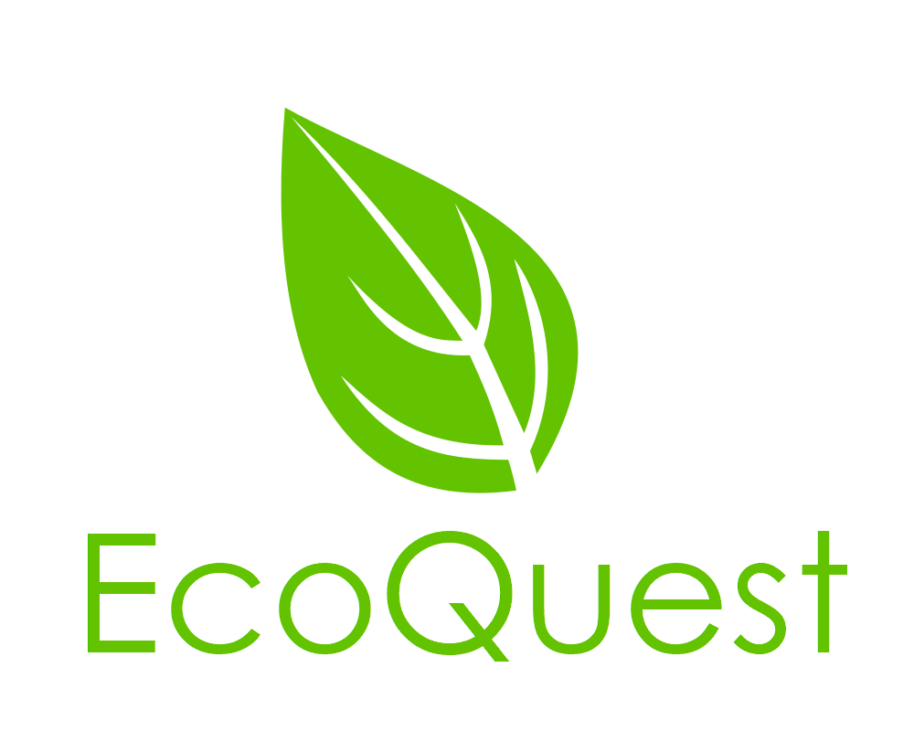

<p align="center">
    <a href="https://github.com/ClayCore/HackHeroes2019">
        
    </a>
</p>

## Spis treści

* [O Projekcie](#o-projekcie)
  * [Technologie](#technologie)
* [Wprowadzenie](#wprowadzenie)
  * [Wymagania](#wymagania)
  * [Instalacja](#instalacja)
* [Użytkowanie](#uzytkowanie)
* [Zasady dodawania kodu](#contributing)
* [Roadmap](#roadmap)
* [Licencja](#licencja)


<a name="o-projekcie"></a>
## O Projekcie

*EcoQuest* to aplikacja internetowa na telefony, która została stworzona na potrzeby ostatniej edycji konkursu Hack Heroes dla szkół średnich.
Tematyką konkursu są **Problemy globalne**.

<a name="technologie"></a>
### Technologie

* [Node.js](https://nodejs.org/en/)
* [Express.js](https://expressjs.com/)
* [React.js](https://reactjs.org)
* [Connect](https://github.com/senchalabs/connect#readme)
* [Morgan](https://github.com/expressjs/morgan#readme)
* [MongoDB](https://www.mongodb.com/)
* [Heroku](https://heroku.com)

<a name="wprowadzenie"></a>
## Wprowadzenie

*EcoQuest* jest zasilany przy wykorzystaniu serwera **Express.js**. Pozwala to na szybkie przestawienie lokalnego serwera na hosting.
Do front-endu została wykorzystana biblioteka **React.js**.
Baza projektu została postawiona na portalu **GitHub** przy pomocy programu **git**.

<a name="wymagania"></a>
### Wymagania

* **[Node.js](https://nodejs.org/en/download)**

* **[git](https://gitforwindows.org/)**

* Do edycji kodu źródłowego zalecany jest **[Visual Studio Code](https://code.visualstudio.com/)**

<a name="instalacja"></a>
### Instalacja

1. Sklonowanie repozytorium

```sh
git clone https://github.com/ClayCore/HackHeroes2019.git
```

2. Zainstalowanie zależności dla serwera

```sh
cd HackHeroes2019/api

npm install
```

3. Zainstalowanie zależności dla klienta

```sh
cd HackHeroes2019/client

npm install
```

4. Po zainstalowaniu wszystkich bibliotek, *EcoQuest* jest gotowa do użytku.

<a name="uzytkowanie"></a>
## Użytkowanie

Do poprawnego działania aplikacji potrzebujemy serwera, który będzie hostował naszą bazę danych oraz panel kontrolny administracji, oraz klienta, który pobiera dane z wcześniej wymienionego serwera do naszej aplikacji.

~~Potrzebujemy również lokalnego serwera **MongoDB**, który umożliwi serwerowi połączenie z bazą danych na porcie **27017**~~
Baza danych jest postawiona zewnętrznie na serwisie **MongoDB Atlas**

Po instalacji w folderze *`api`* oraz *`client`* należy przywołać polecenie **`npm start`**.

Po wykonaniu polecenia pokaże nam się adres URL, na którym jest postawiona nasza strona; domyślne port'em dla serwera jest **9000** a dla klienta **3000**: 
 - `http://localhost:3000`  -> Aplikacja internetowa dla klientów/użytkowników,
 - `http://localhost:9000`  -> Serwer i panel kontrolny dla administratorów

<a name="contributing"></a>
## Zasady dodawania kodu

Proszę odnieść się do pliku [CONTRIBUTING](https://github.com/ClayCore/HackHeroes2019/blob/master/CONTRIBUTING).

<a name="roadmap"></a>
## Roadmap

- [x] Zdefiniowanie struktury folderów,
- [x] Sporządzenie wymagań i początki dokumentacji projektu,
- [x] Stworzenie lokalnego serwera na bazie **Node.js** do serwowania statycznych witryn do testów,
- [x] Stworzenie repozytorium i dodanie plików,
- [x] Przesłanie lokalnego repozytorium na portal **GitHub**,
- [x] Dodanie wszystkich członków grupy do listy współautorów repozytorium,
- [x] Napisanie początkowych modułów i szablonów projektu,
- [x] Stworzenie testowych szablonów witryn, stylów oraz funkcjonalności,
- [x] Refaktoryzacja całej bazy kodu na **React.js**,
- [x] Refaktoryzacja back-endu strony i napisanie łatwego w użyciu API,
- [x] Dodanie bazy danych na podstawie technologii **MongoDB**,
- [x] Połączenie bazy danych z aplikacją przez serwer **Express.js**,
- [x] Stworzenie początkowej struktury bazy danych,
- [x] Przystosowanie serwera do serwowania dynamicznych danych,
- [ ] Wykończenie zawartości oraz podstawowych arkuszów stylów aplikacji,
- [ ] Wykończenie strony ze strony *back-end'u*,
- [ ] Napisanie responsywnych arkuszów stylów i dynamiczne podpięcie ich w celu osiągnięcia responsywności aplikacji,
- [ ] Przetłumaczenie zawartości witryn na język angielski,
- [ ] Przetłumaczenie treści na język niemiecki,
- [ ] Ostatnie debugowanie projektu i wypuszczenie go z produkcji,
- [ ] Postawienie skończonej aplikacji na **Heroku** w celach hosting'u,

<a name="licencja"></a>
## Licencja

Proszę zobaczyć plik [LICENSE](https://github.com/ClayCore/HackHeroes2019/blob/master/LICENSE).